# gOS — Gauthiii's Operating System

A hobby x86_64 operating system, built completely from scratch: no existing kernel, no existing libc, no existing GUI toolkit. Everything from the UEFI boot handoff to a clickable file manager is hand-written C and x86_64 assembly.

gOS boots via [Limine](https://github.com/limine-bootloader/limine) into a desktop with a background, a taskbar, and a "Files" launcher icon in about a second; draws directly to a framebuffer; runs its own windowing system with draggable/overlappable/closable windows; renders its own bitmap-font text; reads and writes a real FAT32 disk image through a hand-written ATA PIO driver; and has a graphical File Manager with full CRUD — create folders/files, open and edit text files, save with Ctrl+S, delete, and rename — all backed by the real filesystem, not a mock. Unhandled CPU exceptions show a red kernel panic screen instead of silently hanging.

Development is tracked as a sequence of phases. v1.0 (Phases 0–11) is documented in [version1/PROJECT_PLAN.md](version1/PROJECT_PLAN.md), each with its own detailed write-up (`version1/phase0.md` through `version1/phase11.md`). Past v1.0, [version1/phase-patch.md](version1/phase-patch.md) documents a follow-up patch (a real hang fix plus unlabeled-button UX fix), and [version1/audit.md](version1/audit.md) is a standalone, read-only flaw audit of the whole v1.0 kernel (24 ranked findings). [project-plan-2.md](project-plan-2.md) is the v2 plan (**Track A** audit fixes + **Track B** new features, both complete) plus the start of v3 (**Track C** OS internals, **Track D** desktop/storage, **Track E** apps) — see [phase12.md](phase12.md)–[phase14.md](phase14.md) for Track A, [phase15.md](phase15.md)–[phase17.md](phase17.md) for Track B, and [phase18.md](phase18.md) for v3's first phase.

---

## Specs

gOS targets a real (or emulated) x86_64 PC. The numbers below are the environment the whole project has been built and tested against — QEMU's `q35` machine type — plus the actual hard-coded kernel constants that define its capabilities.

| Category | Detail |
|---|---|
| **Architecture** | x86_64 (64-bit long mode), higher-half kernel |
| **CPU** | Single core only — no SMP/multi-core support, no APIC/x2APIC (legacy 8259 PIC only) |
| **RAM** | Tested at 256 MiB (QEMU `-m 256M`); usable memory detected dynamically from the Limine memory map at boot, so more/less works, but only one contiguous kernel heap is ever set up |
| **Boot firmware** | UEFI only, via [Limine](https://github.com/limine-bootloader/limine) — no legacy BIOS/CSM path |
| **Chipset (test target)** | QEMU `q35` machine type |
| **Storage controller** | Hand-written ATA PIO driver, primary master IDE channel only — no secondary channel, no AHCI, no NVMe, no SATA native command queuing |
| **Disk** | 64 MiB raw disk image (`disk_images/gos_disk.img`), seeded once via `mtools`/`mformat`, persists across reboots |
| **Filesystem** | FAT32, hand-written from scratch (BPB parsing, cluster-chain walking with cycle detection, directory entries, 8.3 names only — no long filenames) |
| **Display** | Framebuffer graphics via Limine's GOP handoff, currently 1280x800 (whatever resolution Limine/UEFI negotiates), 32bpp, double-buffered |
| **Input** | PS/2 keyboard (with extended 0xE0-prefixed scancode handling) and PS/2 mouse only — no USB HID beyond QEMU's emulated PS/2 translation |
| **Windowing** | Custom compositor: up to `MAX_WINDOWS = 8` simultaneous windows, draggable/overlappable/z-ordered/closable/minimizable/maximizable, with a persistent taskbar for restore/focus — no free-form resize (drag-to-resize an edge/corner) |
| **Text rendering** | Hand-embedded 8x8 bitmap font (no font file loading, no anti-aliasing, no Unicode — ASCII only) |
| **Memory management** | Bitmap physical page allocator, 4-level paging (kernel controls its own page tables), `kmalloc`/`kfree` heap allocator with double-free detection, dedicated 16 KiB IST1 stack for double-fault/NMI |
| **Interrupts** | Custom GDT/IDT/TSS, PIC-remapped hardware IRQs, spurious-IRQ7/15 detection |
| **Networking** | None |
| **Audio** | None |
| **Multi-user / permissions** | None — single implicit user, no privilege separation, kernel memory mapped uniformly RWX (no W^X enforcement) |
| **Toolchain** | `x86_64-elf-gcc` (freestanding, no libc), NASM, `x86_64-elf-gdb`, built and tested on macOS + QEMU (Linux hosts work with equivalent packages) |

**Status: v1.0 complete, plus post-v1.0 patch, plus Track A (all 24 audit findings fixed), plus all of Track B (Phases 15–17: cursor/wallpaper, window minimize/close/taskbar, maximize), plus v3 Phase 18 (boot-time cleanup).** Toolchain → bootloader → interrupts → memory management → drivers → graphics → windowing → fonts/text input → FAT32 filesystem → file manager UI → CRUD operations → polish/stability (v1.0) → 5 Critical + 6 High + 12 Medium/Low audit fixes (Track A, Phases 12–14) → real arrow cursor + gradient/BMP wallpaper (Track B, Phase 15) → window minimize + persistent taskbar restore/focus (Track B, Phase 16) → window maximize/restore (Track B, Phase 17) → default boot time cut from ~75-80s to ~1s (v3, Phase 18). Phases 19–24 (user mode/multitasking, window resize/Alt+Tab, RTC/clock/settings, long filenames, shell/calculator/image viewer) have not started yet — see [project-plan-2.md](project-plan-2.md)'s status tracker.

### Known limitations

- **v1.0 scope boundaries** (still true today): no networking, no multi-core/SMP, no sound, no USB beyond QEMU's emulated PS/2, no real package manager, no POSIX compatibility, no multi-user/permissions, no JIT/scripting layer, no fine-grained W^X page permissions (kernel mapped uniformly RWX).
- **No user mode / multitasking yet (Phases 19–20, not started)**: everything runs as kernel-mode code in a single loop; no processes, no syscalls, no ELF loading.
- **No free-form window resize**: a window can be dragged, minimized, and maximized/restored to its exact prior geometry, but there's no drag-an-edge-or-corner resize handle (planned for Phase 21).
- **No long filenames**: FAT32 support is 8.3 names only (planned for Phase 23).
- **Environment-specific hardware assumptions carried from v1.0**: single ATA drive on the primary master IDE channel (no secondary channel, no AHCI/NVMe), legacy 8259 PIC only (no APIC/x2APIC), PS/2 keyboard/mouse only.
- **Known-safe-by-convention, not by construction**: `fm.c`'s double-click file identity is tracked by row index, not filename — safe today only because every listing-mutating code path calls `fm_refresh()` first (see Finding #24 in [phase14.md](phase14.md)); documented as an explicit invariant rather than hardened against.

---

## What's actually working right now

- Boots a real x86_64 machine (or QEMU) via UEFI/Limine into a 64-bit higher-half kernel
- Custom GDT/IDT, exception handling, PIC-remapped hardware interrupts
- A physical page allocator, 4-level paging under kernel control, and a `kmalloc`/`kfree` heap
- Serial (COM1), PIT timer, and PS/2 keyboard + mouse drivers
- Raw framebuffer graphics: pixel plotting, rectangles, lines, double buffering
- A windowing system: multiple draggable, overlapping, z-ordered windows with clickable buttons
- A bitmap font renderer and a text box widget with a blinking cursor, wired to the keyboard
- A from-scratch FAT32 driver (via a hand-written ATA PIO disk driver) — reads and writes real files/directories, verified against `mtools` on the host
- A graphical **File Manager** window: browse folders, navigate to arbitrary depth, see files vs. folders visually distinguished, select a file
- Full **CRUD**: New Folder/New File (via a reusable modal text-input dialog), Delete (with a confirmation dialog), Rename, and a real **Text Editor** — double-click a file to open it, edit with the keyboard, press Ctrl+S to save back to disk, with changes verified to persist across a reboot
- A **desktop**: wallpaper background, a "Files" launcher icon (the File Manager no longer auto-opens — click to launch it), a **taskbar** listing every open window with click-to-focus, and a close ("X") button on every window
- A red full-screen **kernel panic display** on any unhandled CPU exception (vector, error code, RIP, and CR2 for page faults), instead of a silent hang
- An automated boot-time **stress test** (150 file create/write/rename/delete cycles + 300 window create/close cycles) proving the system survives rapid churn without crashing
- **Post-v1.0 audit remediation (Track A, Phases 12–14):** a dedicated IST stack for double-fault/NMI so a stack overflow shows the panic screen instead of a triple-fault reset; FAT32 chain-walk cycle detection so a corrupted disk can't hang the kernel; `kfree()` double-free detection; `vmm_unmap_page()` with proper TLB invalidation; an ATA drive-presence probe so a missing disk fails fast instead of burning a ~100,000-iteration busy-wait; window drag coordinates clamped to the screen edge; every `window_create()` call site checked, with a new on-screen flash-message mechanism surfacing failures the user would otherwise never see; and 15 further correctness/robustness fixes — see [phase12.md](phase12.md), [phase13.md](phase13.md), [phase14.md](phase14.md) for the full list, each with a live before/after QEMU reproduction of the original bug
- **Cursor & wallpaper (Track B, Phase 15):** a real 12x19 arrow-shaped mouse cursor with transparency, drawn in the compositor's true top layer (above every window and the taskbar); a desktop wallpaper layer — a vertical gradient by default, or a hand-decoded 24bpp BMP image (`WALLPAPR.BMP`) bundled on the FAT32 disk image and loaded through the hardened FAT32 read path, with graceful fallback to the gradient if the file is missing or malformed — see [phase15.md](phase15.md)
- **Window minimize & taskbar restore (Track B, Phase 16):** every window now has a titlebar minimize ("_") button alongside the close ("X") button — minimizing hides a window (state, buttons, and any unsaved textbox content fully preserved) without tearing it down; the taskbar visually dims a minimized window's entry and restores-then-focuses it on click, while an already-visible entry's click just focuses it as before; window teardown on close was verified leak-free with a real heap measurement across 20 open/close cycles — see [phase16.md](phase16.md)
- **Window maximize/restore (Track B, Phase 17):** a third titlebar button (a teal square, toggling to two overlapping squares when maximized) fills a window to the full screen minus the taskbar, and restores it to its exact prior position and size on a second click — proven to round-trip geometry exactly via both a numeric before/after/restore log and a live visual test; dragging is disabled while maximized (restore first) — see [phase17.md](phase17.md)
- **Fast boot (v3, Phase 18):** `make run` now reaches the interactive desktop in about a second — the old ~75-80 second boot (a bouncing-rectangle animation, a "Hello, gOS!" hold, a live mouse-cursor test window, and a 450-cycle file/window stress test, all running unconditionally on every boot) is gated behind a new `make diagnostic` build, preserving every regression check with zero loss of coverage while defaulting to a boot that's actually fast to iterate on — see [phase18.md](phase18.md)

---

## Cloning

Limine is vendored as a git submodule, so clone with `--recursive` (or run the submodule command afterward):

```bash
git clone --recursive https://github.com/gauthiii/gOS.git
cd gOS
```

If you already cloned without `--recursive`:

```bash
git submodule update --init --recursive
```

OVMF UEFI firmware (`third_party/ovmf/`) is committed directly to the repo, so no separate download is needed.

---

## Prerequisites (macOS, via Homebrew)

```bash
brew install x86_64-elf-gcc x86_64-elf-gdb nasm qemu xorriso mtools
```

This pulls in the `x86_64-elf-binutils` cross-toolchain as a dependency of `x86_64-elf-gcc`. No CSM/legacy BIOS tooling is needed — gOS only targets UEFI boot.

(A Linux host works too, with the equivalent packages from your distro — the Makefile and toolchain names are the same either way.)

---

## Build and run

```bash
make run
```

This one command: builds the kernel, packages it with Limine into a bootable ISO, creates a 64 MiB FAT32 disk image (first run only — it's preserved across rebuilds so file writes persist), and launches it in QEMU with a real graphical window (mouse and keyboard both work normally in this window). The desktop is interactive in about a second.

Other useful targets:

```bash
make build        # compile the kernel only
make iso          # build the bootable ISO
make debug        # like `run`, but pauses at boot and opens a GDB stub (-s -S)
make diagnostic   # rebuilds with the full pre-Phase-18 boot sequence restored (regression
                   # demos + the 450-cycle file/window stress test) - useful when you actually
                   # want to watch/verify those checks, not for everyday use
make clean        # remove build artifacts (kernel, ISO — NOT the disk image)
```

To force a completely fresh, empty filesystem (wiping any files created during prior sessions):

```bash
rm disk_images/gos_disk.img
make run
```

To inspect or seed the disk image from the host without booting gOS at all, use `mtools` directly, e.g.:

```bash
mdir -i disk_images/gos_disk.img ::
mcopy -i disk_images/gos_disk.img some_file.txt ::/SOME_FILE.TXT
```

---

## Milestone screenshot proofs

Every graphical milestone below was verified with a real screenshot captured from a running gOS instance (via QEMU's `screendump`, converted to PNG) — not just a "build succeeded" log line. Full testing methodology, including independent cross-checks against host tools like `mtools`, is in each phase's `.md` file.

### Phase 7 — Font Rendering & Text Input

**Bitmap font rendering** ([phase7.md](version1/phase7.md), Milestone 7.1)
Renders "Hello, gOS!" at a fixed screen position using a hand-embedded 8x8 bitmap font — the first real text gOS ever drew.


**Real window titles** ([phase7.md](version1/phase7.md), Milestone 7.2)
Window title bars now show actual rendered text ("Window A", "Window B", "Text Editor") instead of placeholder rectangles, clipped correctly to each title bar's bounds.


**Typed text in a window** ([phase7.md](version1/phase7.md), Milestone 7.3)
Keyboard input routed to the focused window's text box widget — simulated typing of "hello" appears correctly, with a blinking `_` cursor at the insertion point.


**Backspace and Enter handling** ([phase7.md](version1/phase7.md), Milestone 7.3)
Typed "gosx", backspaced to remove the "x" (leaving "gos"), then pressed Enter and typed a shifted character ("@") — verified correct at the pixel level, not just visually.

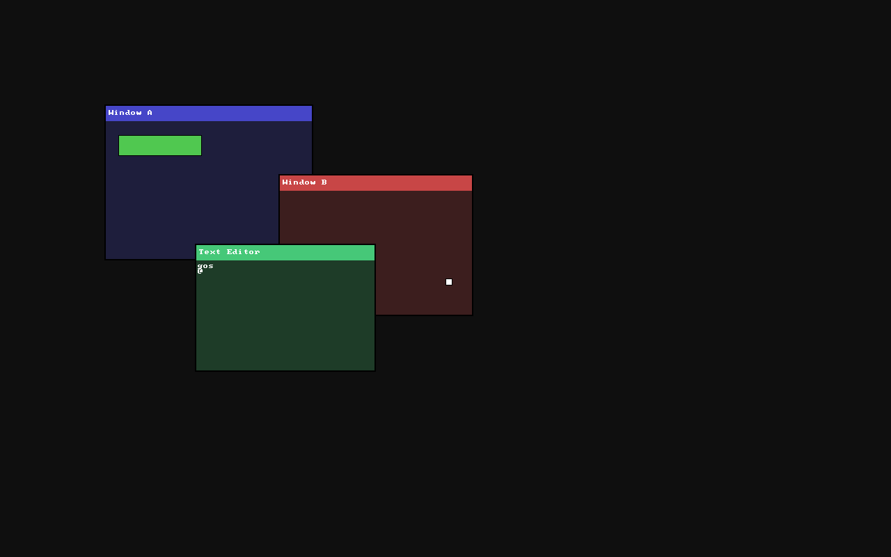

### Phase 9 — File Manager UI

**Root directory listing** ([phase9.md](version1/phase9.md), Milestone 9.1)
The File Manager window open at the FAT32 root directory: a toolbar (Up / New Folder / New File / Delete / Rename), a `/` breadcrumb, and four rows — folders (`TESTDIR`, `LEVEL1`) shown with an amber icon square, files (`HOSTFILE.TXT`, `PERSIST.TXT`) with a gray one.

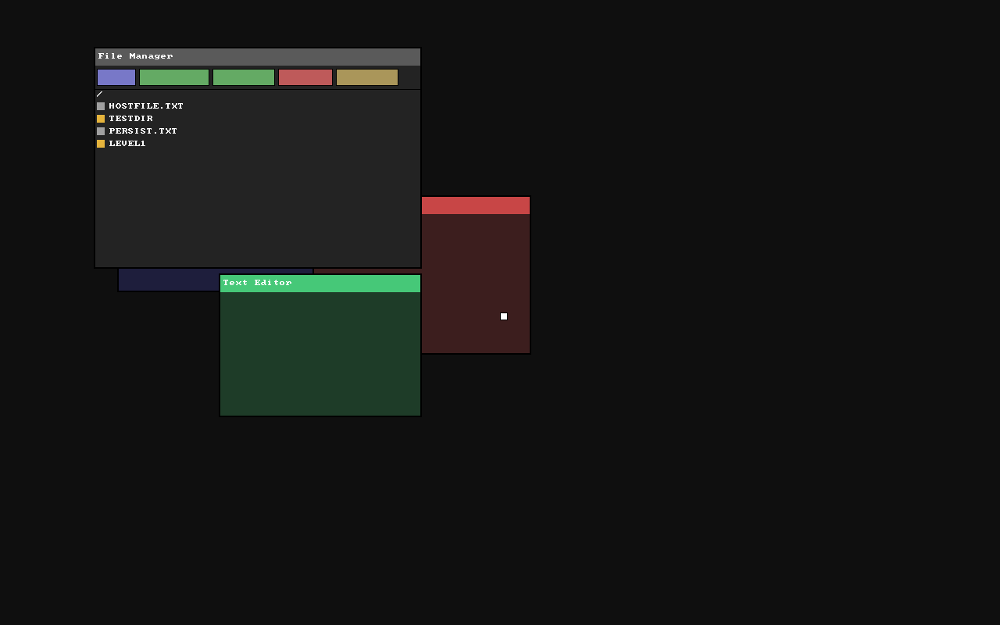

**One level deep** ([phase9.md](version1/phase9.md), Milestone 9.2)
After clicking `LEVEL1`, the breadcrumb updates to `/LEVEL1` and the listing re-renders to show only that folder's contents (`LEVEL2`).


**Two levels deep** ([phase9.md](version1/phase9.md), Milestone 9.2)
Clicking further into `LEVEL2` updates the breadcrumb to `/LEVEL1/LEVEL2` and lists `LEVEL3`.


**Three levels deep** ([phase9.md](version1/phase9.md), Milestone 9.2)
The deepest test folder, `/LEVEL1/LEVEL2/LEVEL3`, showing `DEEP.TXT` — proving click-to-open navigation works to arbitrary depth, cross-checked against the host's own `mdir` output for the same path.

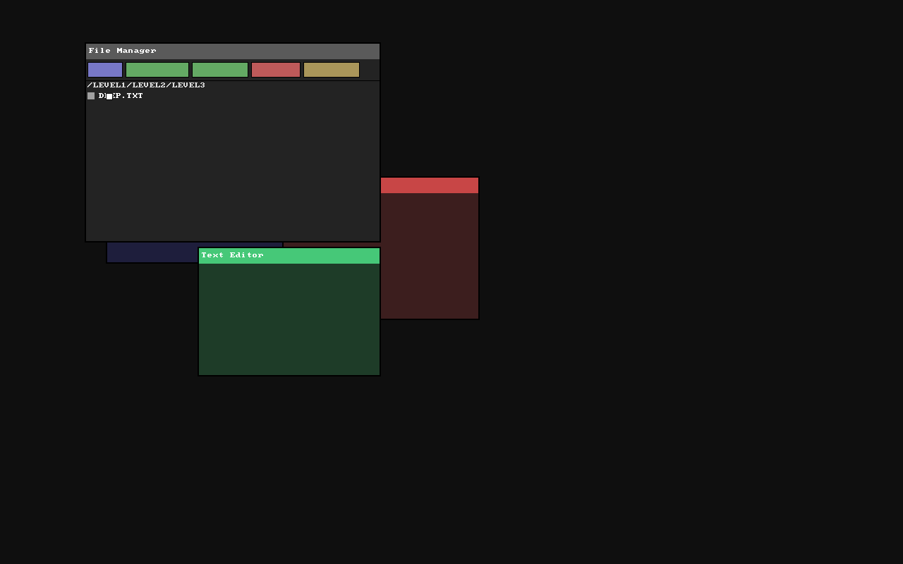

**File selected at depth** ([phase9.md](version1/phase9.md), Milestone 9.3)
Clicking the file `DEEP.TXT` (rather than a folder) selects it instead of navigating — shown highlighted in blue.

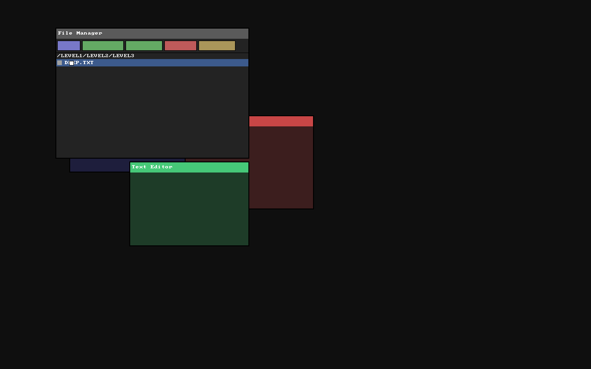

**Back at root after three Up clicks** ([phase9.md](version1/phase9.md), Milestone 9.2)
Three consecutive clicks on the Up button correctly walk back `/LEVEL1/LEVEL2/LEVEL3` → `/LEVEL1/LEVEL2` → `/LEVEL1` → `/`, restoring the original 4-entry root listing.


**File selection highlight at root** ([phase9.md](version1/phase9.md), Milestone 9.3)
Single-item selection highlighting shown at the root level: clicking `PERSIST.TXT` highlights exactly that row in blue, with every other row left untouched.

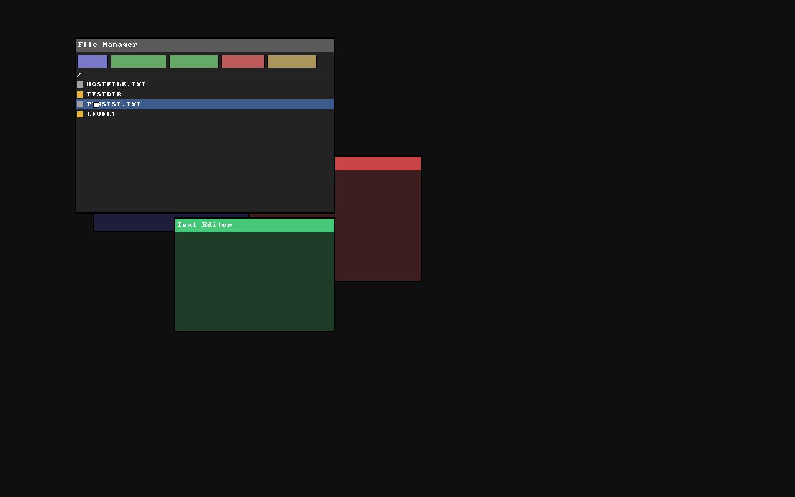

### Phase 10 — CRUD Operations

**Create: New Folder and New File** ([phase10.md](version1/phase10.md), Milestone 10.1)
A new folder (`NEWDIR`) and a new file (`NEWFILE`) created from the UI via a reusable text-input dialog, appearing immediately in the listing — both independently confirmed with the host's own `mdir`.

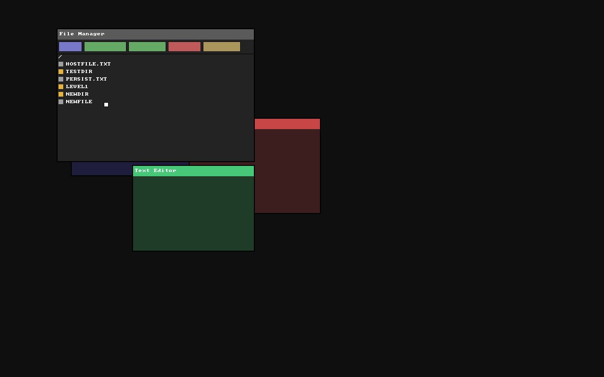

**Read: Text Editor opens a real file** ([phase10.md](version1/phase10.md), Milestone 10.2)
Double-clicking `HOSTFILE.TXT` opens it in a real Text Editor window, retitled to the filename, showing its exact original content read via `fat_read_file()`.

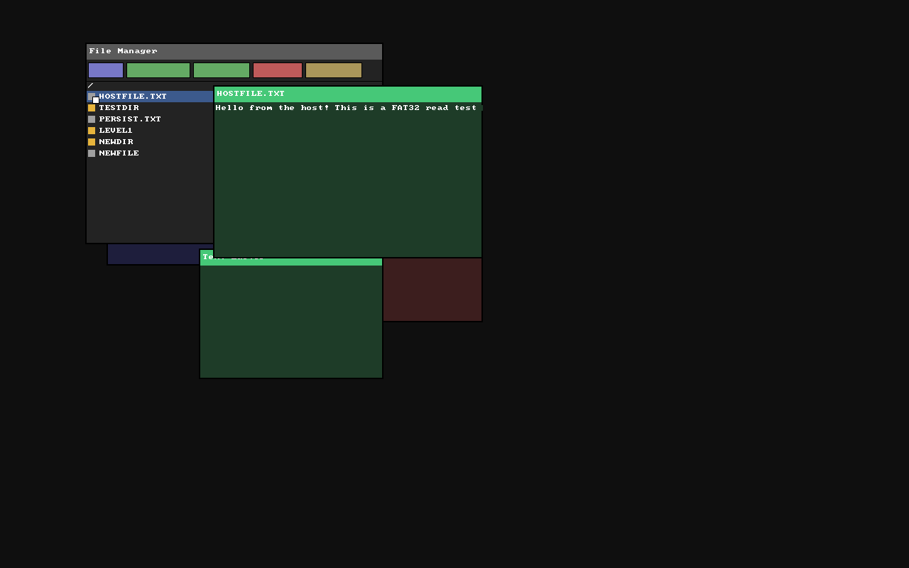

**Update: edited and saved with Ctrl+S** ([phase10.md](version1/phase10.md), Milestone 10.3)
Typed `#appended` into the editor and pressed Ctrl+S — the file grew from 53 to 62 bytes on disk, confirmed by reopening it after a full reboot (a fresh QEMU process with no memory of the prior session) and independently via host `mtype`.

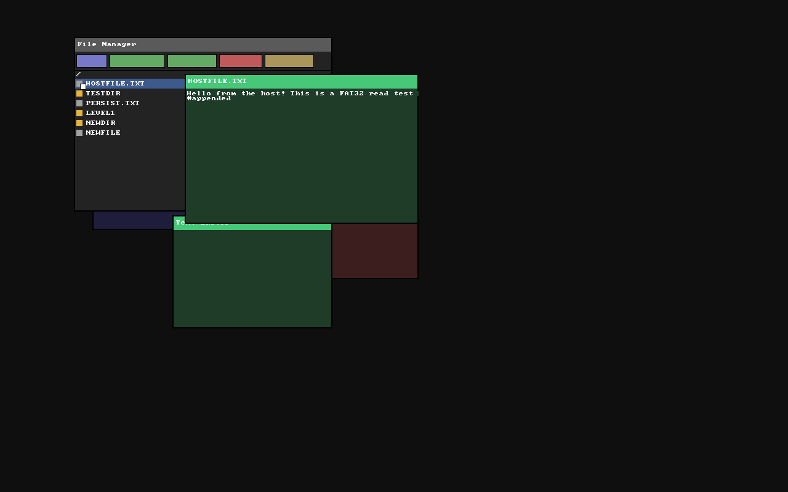

**Delete confirmation dialog** ([phase10.md](version1/phase10.md), Milestone 10.4)
Clicking Delete on a selected file opens a Yes/No-style confirmation dialog before anything is removed.

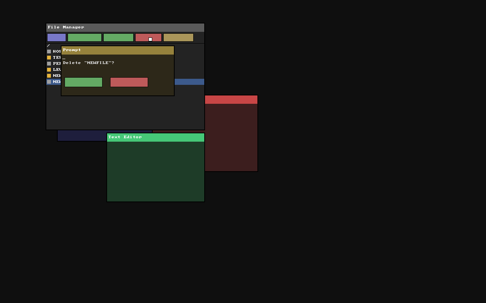

**After delete** ([phase10.md](version1/phase10.md), Milestone 10.4)
`NEWFILE` is gone from the listing after confirming — independently verified against the host's own `mdir`, with every other entry left untouched.

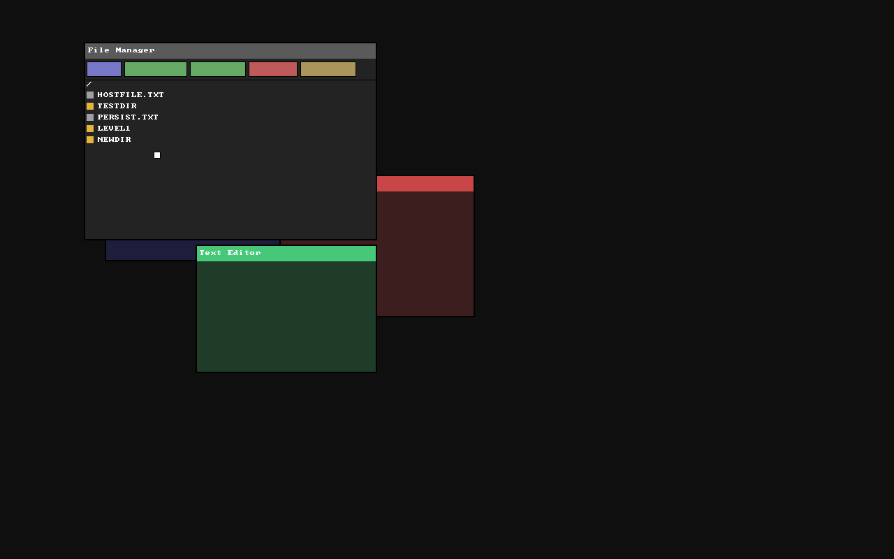

**Rename dialog, pre-filled** ([phase10.md](version1/phase10.md), Milestone 10.4)
The rename dialog pre-fills the text box with the file's current name (`PERSIST.TXT`) so the user edits rather than retypes it from scratch.

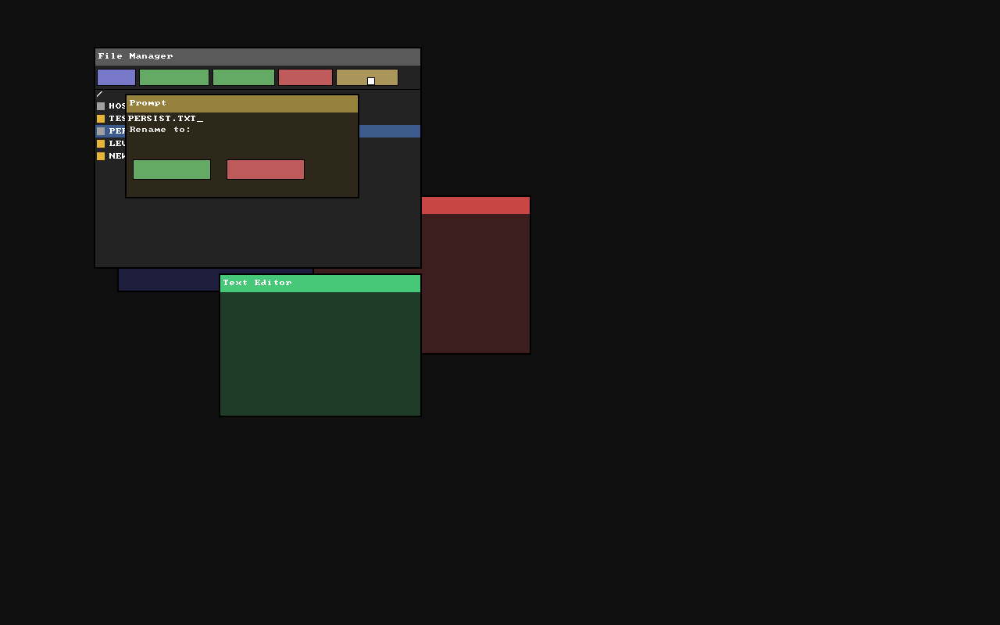

**After rename** ([phase10.md](version1/phase10.md), Milestone 10.4)
`PERSIST.TXT` renamed to `RENAMED`, same 35-byte size (only the directory entry's name bytes changed) — confirmed independently via `mdir`.


### Phase 11 — Polish / Stability

**Desktop with taskbar and launcher icon** ([phase11.md](version1/phase11.md), Milestone 11.2)
The desktop right after boot: a wallpaper background, the "Files" launcher icon (top-left), Windows A/B/C each with a close ("X") button, and a taskbar across the bottom listing all three open windows. Notably, the File Manager is **not** open yet — it no longer auto-opens at boot.

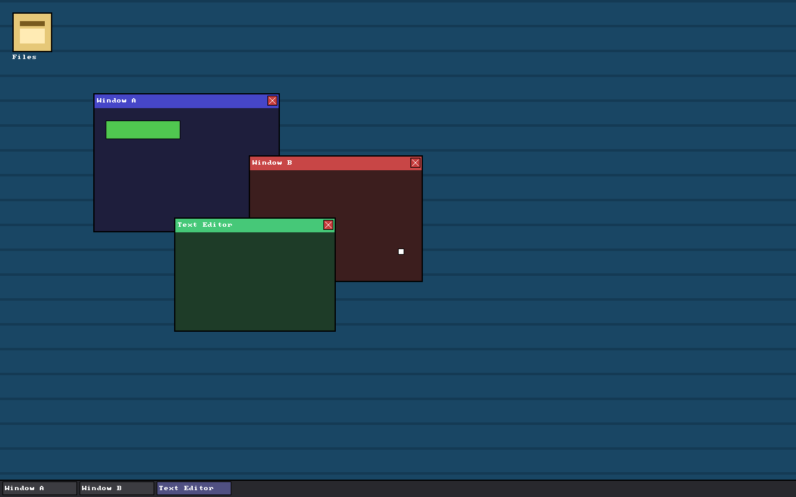

**File Manager launched from the desktop icon** ([phase11.md](version1/phase11.md), Milestone 11.2)
Clicking the "Files" icon launches the File Manager on demand, showing the real, persisted contents of the FAT32 disk from every prior phase's testing. The taskbar now lists 4 entries and the icon shows a small "running" indicator dot.

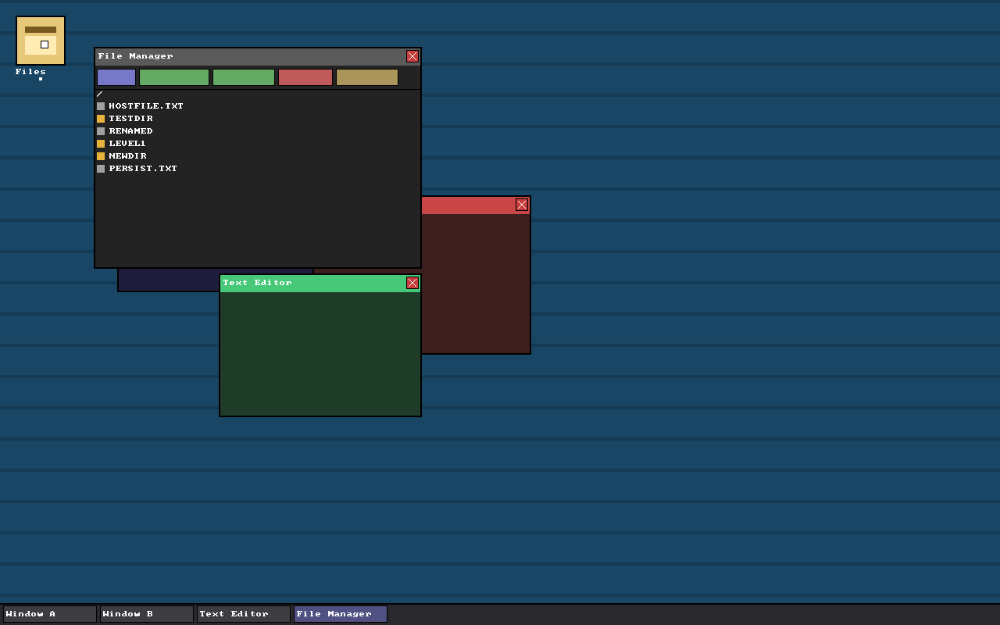

**Window closed via its "X" button** ([phase11.md](version1/phase11.md), Milestone 11.2)
Clicking Window A's close button removes it immediately — the taskbar drops from 3 entries to 2, and the remaining windows are unaffected.

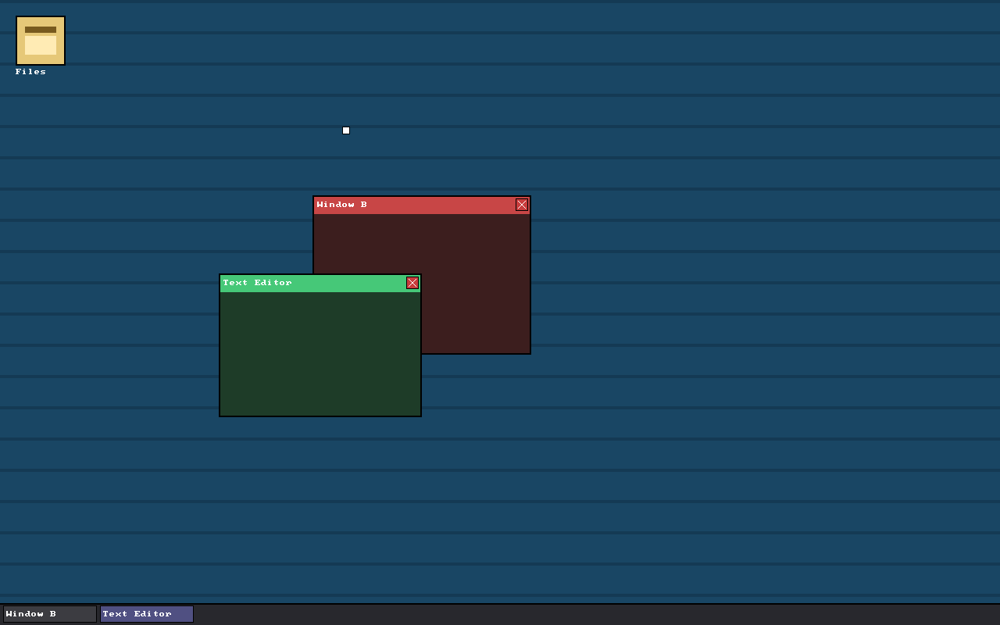

**Taskbar click-to-focus** ([phase11.md](version1/phase11.md), Milestone 11.2)
Clicking "Window B"'s taskbar entry raises it to the front of the z-order (drawn on top of Text Editor) and highlights its entry, even though it was the backmost window a moment before.

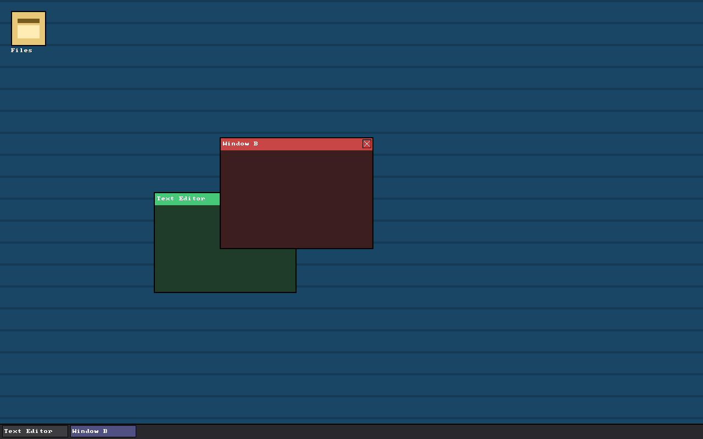

**Kernel panic screen** ([phase11.md](version1/phase11.md), Milestone 11.1)
A deliberately-triggered divide-by-zero shows a full red panic screen with the exception name, vector, error code, and faulting RIP, instead of a silent hang — verified against a real CPU exception, not a mockup.


**Full demo: boot → desktop → File Manager → CRUD** ([phase11.md](version1/phase11.md), Milestone 11.3)
An animated GIF assembled from real QEMU screendumps spanning the whole flow — boot, the desktop, launching the File Manager, and the complete Create/Read/Update/Delete cycle.


### Post-v1.0 Patch — Stability & UX fixes

**Buttons now have readable labels** ([phase-patch.md](version1/phase-patch.md))
Every button in the OS used to be a bare colored rectangle with no text. Window A's demo button now reads "Click Me", proving the fix applies OS-wide, not just to one window.

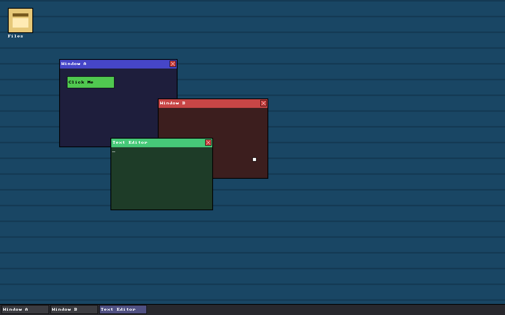

**Desktop still responsive ~48 seconds in** ([phase-patch.md](version1/phase-patch.md))
The main desktop loop used to be bounded to ~25 seconds (a leftover from headless test scripts) and would silently halt forever after that — indistinguishable from a hang during real interactive use. This screenshot, taken ~48 seconds into a live session, shows the File Manager successfully launched by a click sent well past the old cutoff, and its toolbar buttons ("Up", "New Folder", "New File", "Delete", "Rename") now labeled too.

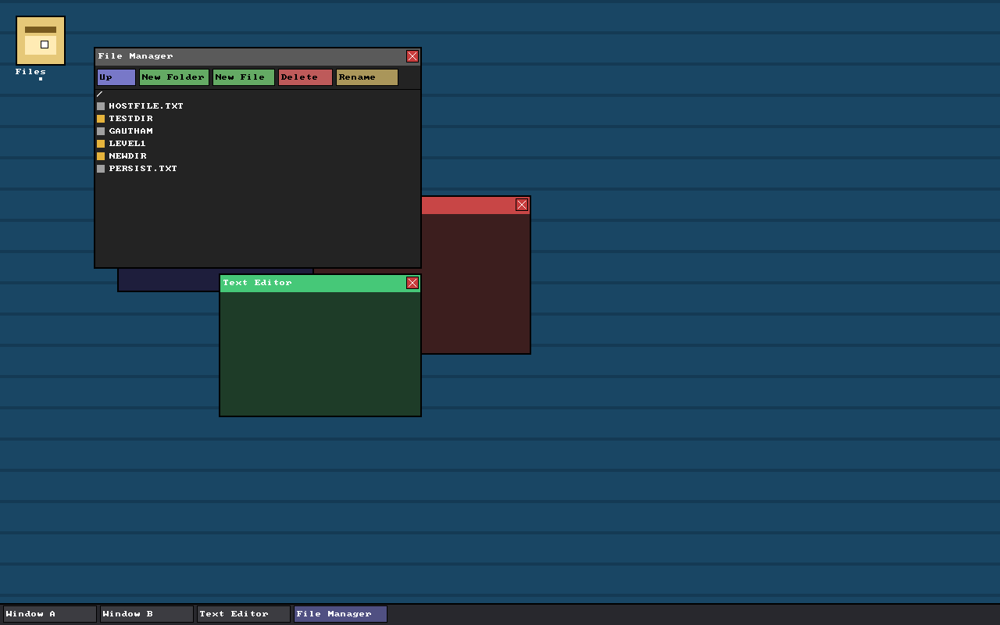

### Phase 15 — Cursor & Wallpaper (Track B)

**Real arrow cursor + BMP wallpaper on the desktop** ([phase15.md](phase15.md), Milestones 15.1/15.3)
The desktop after boot: a hand-decoded 24bpp BMP wallpaper (dusk mountains, loaded from `WALLPAPR.BMP` off the FAT32 disk) fills the whole screen, and the new 12x19 arrow cursor renders on top of it with no leftover pixels from prior frames.

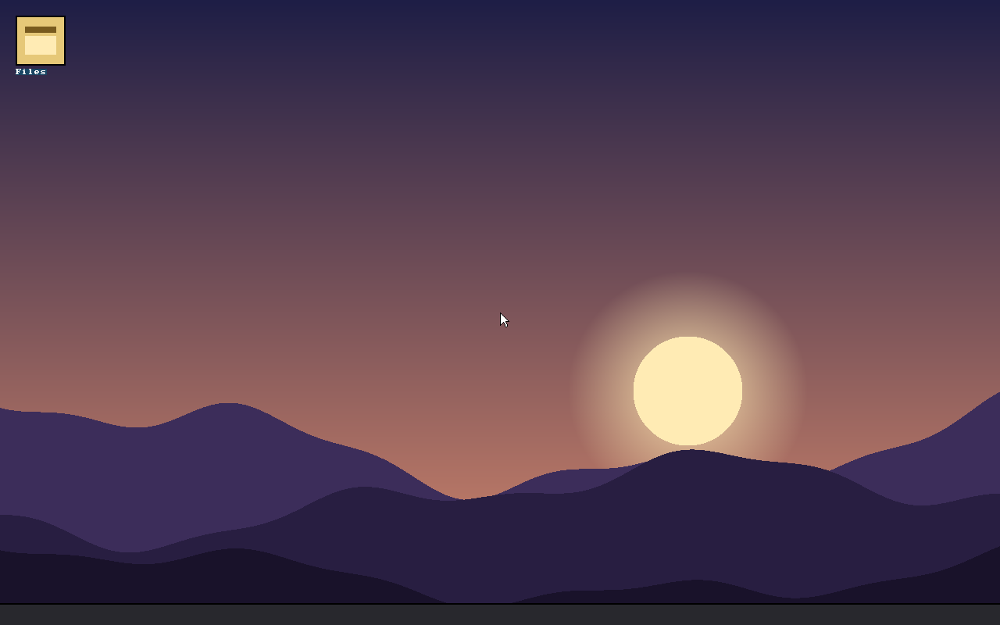

**Cursor renders above windows** ([phase15.md](phase15.md), Milestone 15.1)
The File Manager open over the wallpaper (also listing `WALLPAPR.BMP` itself as a real file on disk) — the cursor sits correctly on top of the window body, not behind it.


**Cursor renders above the taskbar** ([phase15.md](phase15.md), Milestone 15.1)
The bug this phase actually fixed: the old cursor draw call ran before `taskbar_render()`, so it disappeared under the taskbar strip. It's now drawn last in the compositor and stays visible there.

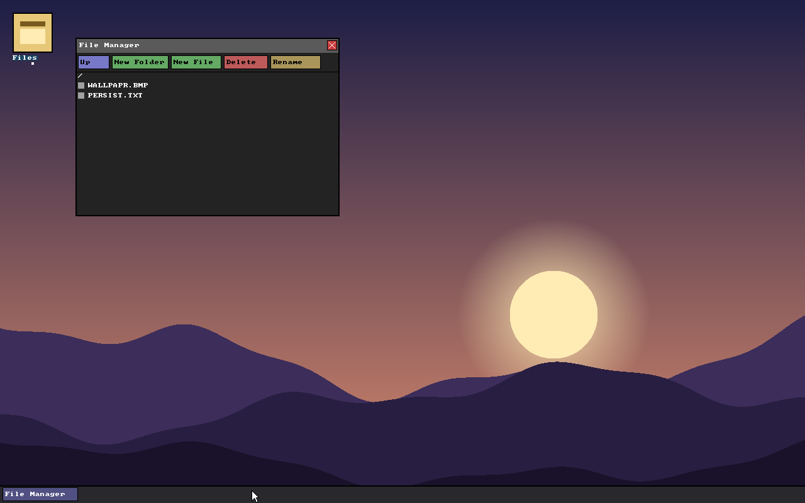

**Gradient fallback when no wallpaper file is present** ([phase15.md](phase15.md), Milestone 15.2)
Booting against a disk image with no `WALLPAPR.BMP` falls back cleanly to the built-in vertical blue→teal gradient instead of a blank or corrupted screen.


**Graceful fallback on a corrupted wallpaper file** ([phase15.md](phase15.md), Milestone 15.3)
The BMP's magic bytes were deliberately corrupted on a scratch disk image; the loader detects this, logs the specific reason, and falls back to the gradient instead of crashing or hanging.

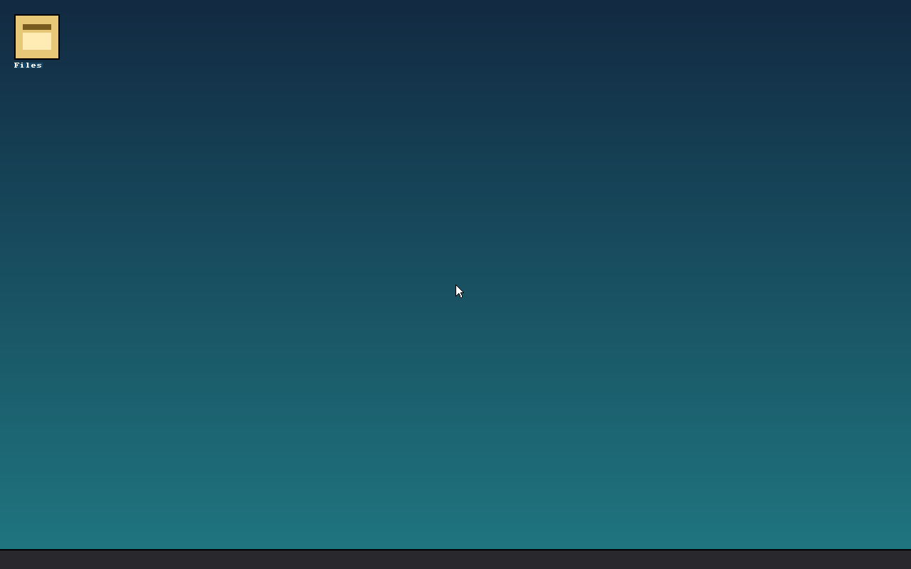

### Phase 16 — Window Close, Minimize & Taskbar (Track B)

**Typing unsaved text, then minimizing the window** ([phase16.md](phase16.md), Milestone 16.2)
The Text Editor open on `PERSIST.TXT` with real, unsaved keystrokes typed into it (" unsaved" appended, never saved to disk) — proving the minimize test exercises a genuine in-memory edit, not just pre-existing file content.


**Minimized: window fully hidden, state preserved** ([phase16.md](phase16.md), Milestone 16.2)
Clicking the new amber "_" button hides the editor completely — only the File Manager remains on screen, and the editor's taskbar entry dims to show it's minimized, not closed.


**Restored via the taskbar: unsaved text still there** ([phase16.md](phase16.md), Milestone 16.3)
Clicking the dimmed taskbar entry restores the editor to its exact original position, focused, with the unsaved " unsaved" text still intact — state genuinely survived the minimize/restore cycle.

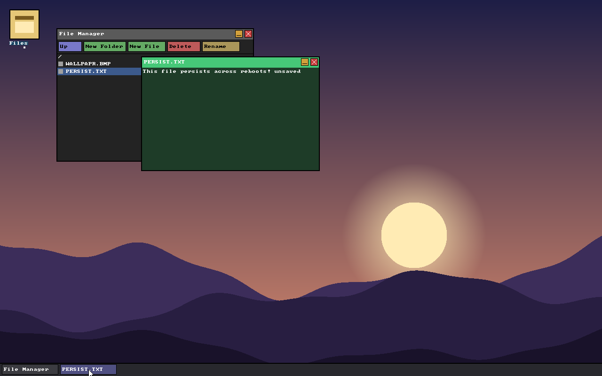

**Three windows open, one minimized** ([phase16.md](phase16.md), Milestone 16.3)
File Manager, Text Editor, and a "New Folder" dialog all open simultaneously — the taskbar correctly lists all three, proving it isn't limited to a fixed set of app types.

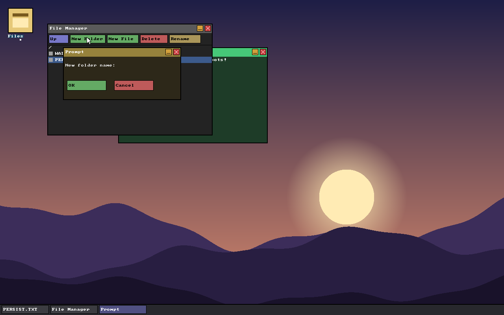

**Dialog minimized, two windows remain** ([phase16.md](phase16.md), Milestone 16.3)
The dialog's entry dims after minimizing it; the editor (previously hidden behind the dialog) is visible again underneath.

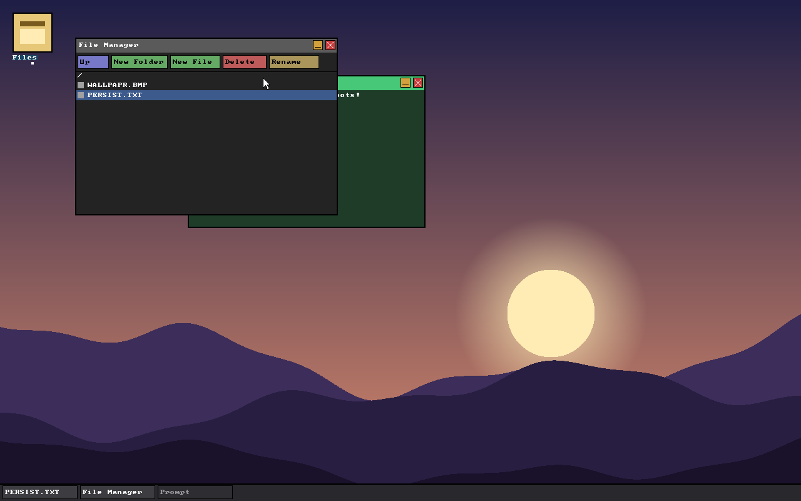

**Two of three minimized** ([phase16.md](phase16.md), Milestone 16.3)
Both the editor and the dialog minimized — only the File Manager remains, with two dimmed taskbar entries confirming the other two are alive but hidden, not closed.


**Editor restored via its taskbar entry** ([phase16.md](phase16.md), Milestone 16.3)
Clicking the editor's dimmed entry brings it back to its exact original geometry (300,120) and focuses it — the dialog stays minimized.

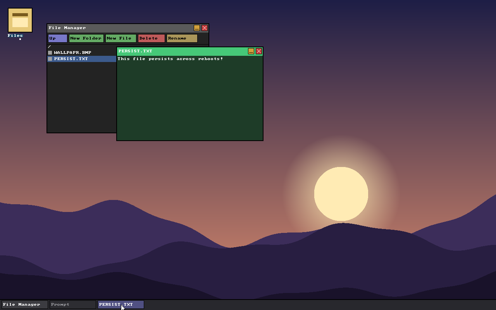

**Dialog also restored, now frontmost** ([phase16.md](phase16.md), Milestone 16.3)
Clicking the dialog's entry restores it too, to its exact original position (160,120), now drawn on top of the editor as the newly-focused window.

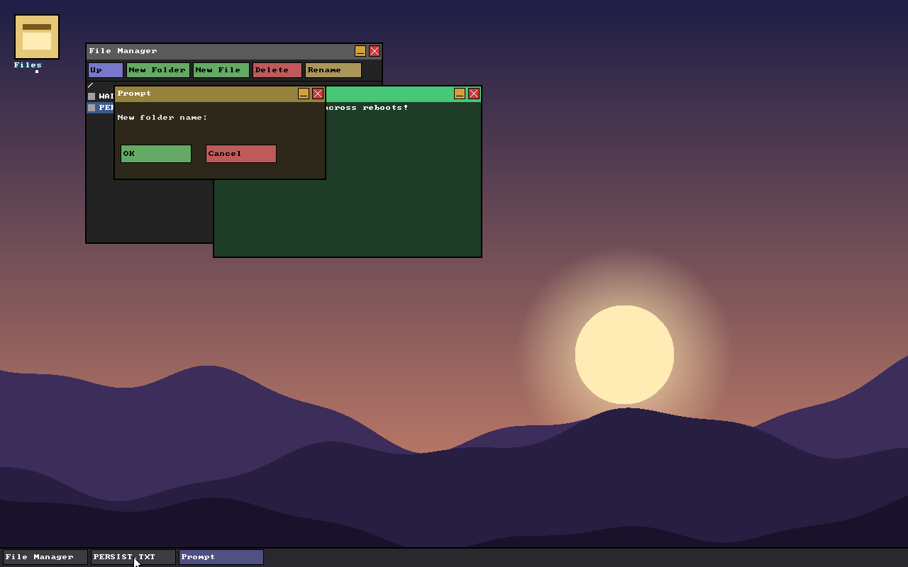

### Phase 17 — Maximize & Polish (Track B)

**Before maximizing: normal window size, three-button titlebar** ([phase17.md](phase17.md), Milestone 17.1)
The Text Editor at its regular 380×220 size — every window now has a teal square maximize button in addition to Phase 16's minimize and close buttons.


**Maximized: fills the screen exactly down to the taskbar** ([phase17.md](phase17.md), Milestone 17.1)
One click on the maximize button and the editor fills the entire screen, with no gap or overlap at the taskbar edge and the wallpaper/File Manager fully hidden underneath.

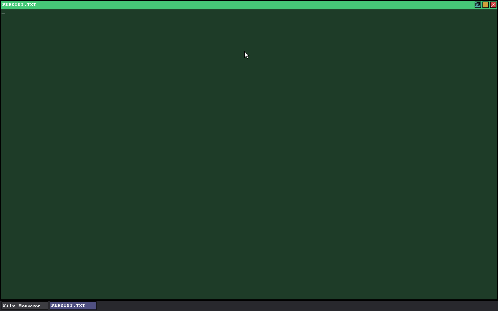

**Restored: back to the exact original position and size** ([phase17.md](phase17.md), Milestone 17.1)
Clicking the button again (now showing the restore glyph) returns the window to precisely where it was — verified both visually here and numerically in the phase doc (137,211,333×141 in, 137,211,333×141 out).

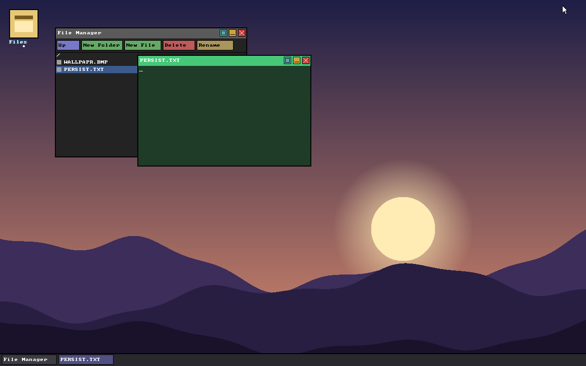

### Phase 18 — Boot-Time Cleanup & Diagnostics Mode (v3)

**Full desktop, screendumped 3 seconds into boot** ([phase18.md](phase18.md), Milestone 18.1)
Wallpaper, the "Files" icon, taskbar, and cursor are all fully rendered within the first few seconds — the old boot sequence would still be partway through a bouncing-rectangle animation at this point.


**File Manager opened via a real simulated click, same fast boot** ([phase18.md](phase18.md), Milestone 18.1)
A genuine mouse click on the Files icon, sent moments after boot starts, successfully opens the File Manager — proving the desktop isn't just visually rendered but fully interactive this early.


---

## Project structure

```
boot/               limine.conf (bootloader configuration)
kernel/
  include/          kernel headers (fb.h, window.h, fat32.h, fm.h, editor.h, desktop.h, taskbar.h, panic.h, ...)
  src/               kernel C sources + a few .asm trampolines (ISR entry, GDT/IDT load, CR3 load)
  linker.ld          higher-half kernel linker script
third_party/
  limine/            vendored bootloader (git submodule)
  ovmf/              UEFI firmware images for QEMU (committed directly)
disk_images/         FAT32 test disk image(s) (gitignored, created by `make disk`)
build/               compiled kernel + ISO (gitignored)
screenshots/         milestone screenshots (including phase11_demo.gif) referenced above and in the phase docs
tools/               host-side helper scripts (e.g. make_wallpaper.py, which generates tools/wallpaper.bmp)
project-plan-2.md    v2 project plan: audit remediation (Track A) + new features (Track B)
phase12.md           Track A, Phase 1: 5 Critical audit fixes
phase13.md           Track A, Phase 2: 6 High-severity audit fixes
phase14.md           Track A, Phase 3: 12 Medium/Low audit fixes (Track A now complete)
phase15.md           Track B, Phase 1: real arrow cursor + gradient/BMP wallpaper
phase16.md           Track B, Phase 2: window minimize + persistent taskbar restore/focus
phase17.md           Track B, Phase 3: window maximize/restore (Track B now complete)
phase18.md           v3, Phase 1: boot-time cleanup (~75-80s -> ~1s default boot) + `make diagnostic`
version1/            all v1.0 planning/completion docs, moved here after v2 planning began
  PROJECT_PLAN.md     the full phase-by-phase roadmap and status tracker
  phase0.md ... phase11.md   detailed completion report for each finished phase
  phase-patch.md      post-v1.0 patch: a real hang fix + unlabeled-button UX fix
  audit.md            standalone, read-only flaw audit of the entire kernel (24 ranked findings)
```

---

## Further reading

- [project-plan-2.md](project-plan-2.md) — the current v2 plan: audit remediation (Track A) followed by new features (Track B), with a full status tracker
- [phase12.md](phase12.md), [phase13.md](phase13.md), [phase14.md](phase14.md) — Track A's three phases: every one of the 24 audit findings, each with the fix, a live QEMU reproduction of the original bug (before/after), and exact commands to reproduce every test
- [phase15.md](phase15.md) — Track B's first phase: the real arrow cursor, gradient wallpaper, and BMP wallpaper loader, each with a "command to test" and a "command to see", plus an independent host-side pixel cross-check against the source BMP
- [phase16.md](phase16.md) — Track B's second phase: window minimize and taskbar restore/focus, each with a "command to test" and a "command to see", a real heap-leak regression measurement for window teardown, and a documented test-script bug (not a kernel bug) found while verifying dynamic taskbar reordering
- [phase17.md](phase17.md) — Track B's third and final phase: window maximize/restore, with an exact geometry round-trip proven both numerically (a debug build logging x/y/w/h at each step) and visually — Track B is complete as of this phase
- [phase18.md](phase18.md) — v3's first phase: cuts the default boot from ~75-80s to ~1s by gating the old regression-demo/stress-test sequence behind a new `make diagnostic` build, with the PIT tick count used to measure the improvement and a log-diff proving zero loss of test coverage
- [version1/PROJECT_PLAN.md](version1/PROJECT_PLAN.md) — full v1.0 project scope, phase breakdown, dependency graph, and status tracker
- `version1/phase0.md` through `version1/phase11.md` — one detailed write-up per completed v1.0 phase: what was built, exact commands to reproduce every test, and any real bugs found (with symptom/diagnosis/fix)
- [version1/phase-patch.md](version1/phase-patch.md) — the post-v1.0 patch: diagnosis and fix for a real desktop-hang bug, plus the unlabeled-button UX fix
- [version1/audit.md](version1/audit.md) — the original read-only, no-changes-made audit of the v1.0 kernel that Track A (Phases 12–14) fully remediates; useful as historical context for *why* each Track A fix exists
